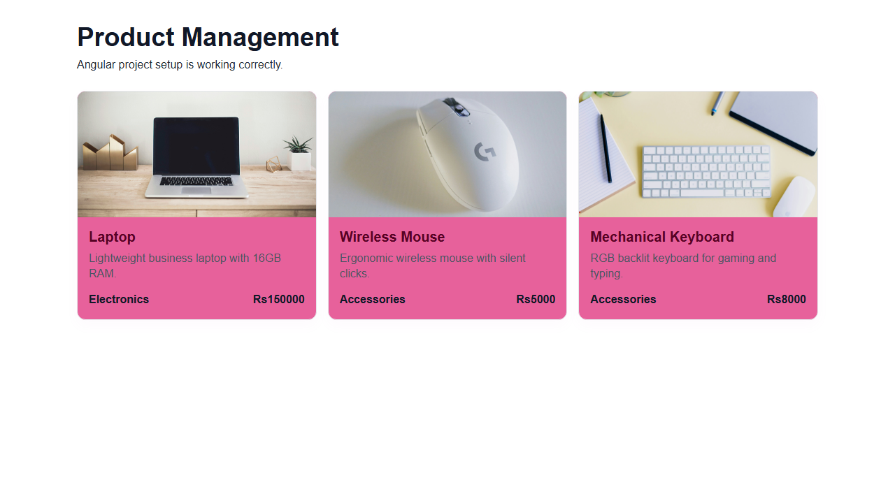

# Product Management System

<div align="center">


</div>

A beginner-friendly Angular project for learning modern Angular concepts by building a Product Management System step by step.

## Screenshot



## Current status

The project is in its initial setup stage. The current app displays a small set of sample products in responsive cards. Routing is configured to show the product page at `/`.

The README describes the intended direction of the project. Features below are marked as planned until implemented.

## Tech stack

- Angular 21 with standalone components
- TypeScript
- HTML and CSS
- Angular Router
- RxJS

## Implemented

- Angular 21 workspace setup
- Product TypeScript interface and sample product data
- Product cards with image, description, category, and price
- Responsive card layout
- Angular built-in `@for` template control flow
- Initial route to the product page

## Planned

- Dashboard with product metrics
- Product listing with search, filtering, and sorting
- Product details page
- Add, edit, and delete product workflows
- Reactive form validation
- Mock CRUD service using Observables
- Loading, error, and empty states
- Unit tests for the service and UI
- Future Spring Boot REST API integration

## Project structure

```text
src/
├── app/
│   ├── products/
│   │   ├── products.ts
│   │   ├── products.html
│   │   ├── products.css
│   │   └── products.spec.ts
│   ├── app.ts
│   ├── app.html
│   ├── app.css
│   ├── app.routes.ts
│   └── app.config.ts
├── index.html
└── main.ts
```

## Getting started

### Prerequisites

- Node.js and npm
- Angular CLI (optional; commands can also be run through `npx ng`)

### Install dependencies

```bash
npm install
```

### Start the development server

```bash
npx ng serve
```

Open [http://localhost:4200](http://localhost:4200). The development server reloads when source files change.

## Build and tests

Build the application:

```bash
npm run build
```

Run unit tests:

```bash
npm test
```

## Learning goals

As the application grows, it will demonstrate:

- Standalone components and component templates
- TypeScript interfaces
- Interpolation and property binding
- Event binding and Angular template control flow
- Routing and route parameters
- Services and dependency injection
- Reactive forms and validation
- CRUD operations with Observables
- Loading and error handling

## Planned architecture

The mock implementation will separate UI components from data access:

```text
Angular Components
        ↓
Product Service
        ↓
Mock Data Layer
```

The planned backend integration will use Angular `HttpClient` with a Spring Boot REST API and MongoDB:

```text
Angular
   ↓
HttpClient
   ↓
Spring Boot REST API
   ↓
MongoDB
```

Expected API endpoints:

```text
GET    /api/products
GET    /api/products/{id}
POST   /api/products
PUT    /api/products/{id}
DELETE /api/products/{id}
```


## Design choices

The project avoids additional UI frameworks and state-management libraries so the Angular fundamentals remain visible and approachable.
